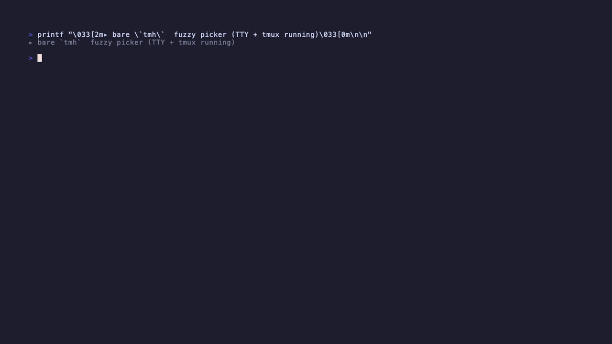
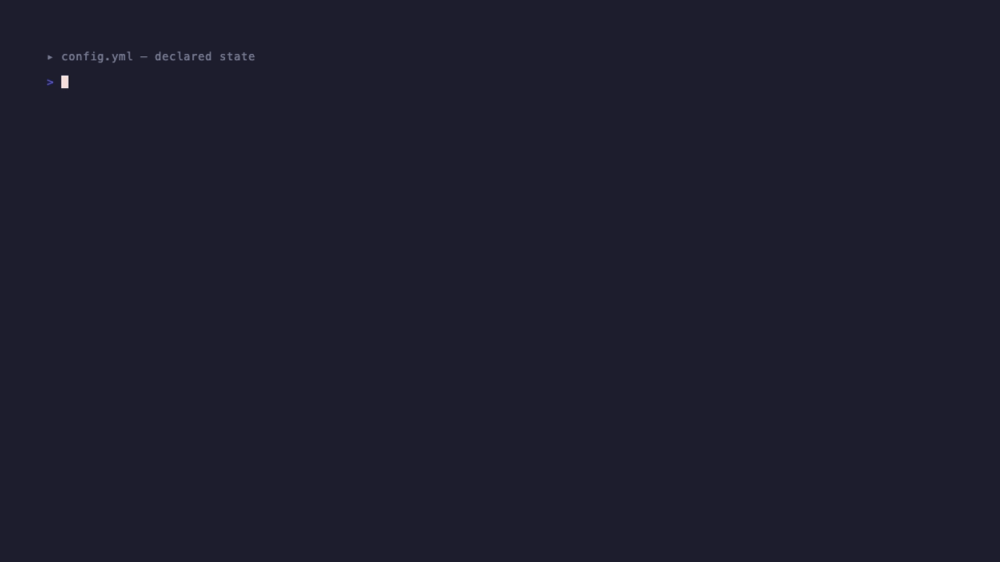

# tmh — русская версия

> Английская версия: [README.md](./README.md).

Декларативные сессии tmux в YAML, drift detection между live и config,
полноценный TUI-дашборд и sesh-style fuzzy picker. Один Go-бинарь, без
плагинов и телеметрии.

[](https://github.com/mark1708/tmh/actions/workflows/ci.yml)
[](https://pkg.go.dev/github.com/mark1708/tmh)
[](https://goreportcard.com/report/github.com/mark1708/tmh)
[](./LICENSE)

<p align="center">
  
  <br><sub><b>picker</b> — голый <code>tmh</code> открывает fuzzy picker сессий</sub>
</p>

<p align="center">
  
  <br><sub><b>tour</b> — полный TUI: help overlay, навигация по дереву, палитра, мастер создания сессии, settings, смена темы, kill + undo, история</sub>
</p>

<p align="center">
  
  <br><sub><b>workflow</b> — объяви в YAML, <code>tmh init</code>, сломай live, <code>tmh diff</code> ловит drift, <code>tmh freeze</code> захватывает назад</sub>
</p>

Собран потому что zsh-функции вокруг `tmux` плохо масштабируются: один
INI-файл, 9 алиасов, нет диффа, нет undo, нет sharing. tmh — это
single-binary замена: один `config.yml`, один тул, и `tmh diff`
который говорит что поломалось — вместо того чтобы узнавать случайно.

---

## Содержание

- [Установка](#установка)
- [Первый запуск](#первый-запуск)
- [Быстрый старт](#быстрый-старт)
- [Язык интерфейса](#язык-интерфейса)
- [Конфиг `config.yml`](#конфиг-configyml)
- [CLI-справочник](#cli-справочник)
- [TUI-дашборд](#tui-дашборд)
- [Picker (bare `tmh`)](#picker-bare-tmh)
- [Process visibility](#process-visibility)
- [Marks и last-location](#marks-и-last-location)
- [tmux-интеграция](#tmux-интеграция)
- [Hooks и trust](#hooks-и-trust)
- [Snapshots и undo](#snapshots-и-undo)
- [Sharing с коллегой](#sharing-с-коллегой)
- [Discovery rules (glob + zoxide)](#discovery-rules-glob--zoxide)
- [`tmh freeze` — захват live в YAML](#tmh-freeze--захват-live-в-yaml)
- [JSON schema и интеграция с редактором](#json-schema-и-интеграция-с-редактором)
- [Модель безопасности](#модель-безопасности)
- [Troubleshooting](#troubleshooting)
- [Архитектура](#архитектура)
- [Лицензия](#лицензия)

---

## Установка

### `go install`

```sh
go install github.com/mark1708/tmh/cmd/tmh@latest
```

Нужен Go 1.25+ (из-за `modernc.org/sqlite`).

### Homebrew

```sh
brew install mark1708/tap/tmh
```

Формула ставит бинарь, man-страницы и bash/zsh/fish completions.

### Из исходников

```sh
git clone https://github.com/mark1708/tmh.git
cd tmh
go build -o ~/.local/bin/tmh ./cmd/tmh
```

### Проверка

```sh
tmh version
tmh doctor
```

`doctor` проверяет:

- tmux ≥ 3.2, `$SHELL`, `config.yml` (существование + схема),
- наличие tmux-сервера, опциональных `fd`, `terminal-notifier` (только
  на macOS),
- отдельный блок **tmux integration** — аудит опций сервера
  (`default-terminal`, `mouse`, `escape-time`, `extended-keys`,
  `base-index`, `pane-base-index`, `renumber-windows`), конфликтующих
  hook'ов (`after-new-window`, `automatic-rename=on`) и наличия
  `#(tmh status)` в `status-right`. Рядом с каждым ⚠/✗ печатается
  готовая строка для `~/.tmux.conf`.

Бинарники релизов подписываются GPG (`checksums.txt.sig`); проверка
через `gpg --verify checksums.txt.sig checksums.txt` —
см. [docs/verify.md](./docs/verify.md).

---

## Первый запуск

Если `~/.config/tmh/config.yml` отсутствует, `tmh` предложит 4 варианта
(при TTY):

1. **start empty** — минимальный config с `version: 1` и пустыми
   секциями.
2. **import from live tmux** — запустить `sync --pull --bootstrap`,
   автоматически собрать `roots:` через LCP-алгоритм по cwd первых
   панелей, импортировать все живые сессии как записи в `sessions:`.
3. **import from file / URL** — прочитать готовый YAML (например от
   коллеги).
4. **quit**.

Рекомендуется вариант 2, если у тебя уже запущен tmux — поднимется
честный YAML со всеми окнами:

```sh
tmh sync --bootstrap
```

После этого `cat ~/.config/tmh/config.yml` содержит `roots:`
(инфернутые префиксы) и `sessions:` с `root: <ключ>` и `path: ...` для
каждого окна.

В non-TTY режиме (pipe, CI) создаётся пустой config молча, `tmh`
продолжает работать — команды `ls`, `attach`, `kill`, `reload --shell`,
`popup`, `scratch`, `window` работают без config (pass-through).

Каждая запись tmh добавляет header-модельную строку
`# yaml-language-server: $schema=…` — любой редактор с yaml-language-server
(VS Code, Helix, Neovim) подхватывает автокомплит и inline-валидацию
автоматически. Подробнее — в
[JSON schema и интеграция с редактором](#json-schema-и-интеграция-с-редактором).

---

## Быстрый старт

```sh
# Импортировать текущий tmux в config.
tmh sync --bootstrap

# После ребута машины — поднять всё одной командой.
tmh init

# Что есть и где drift?
tmh ls
tmh diff

# Переключиться между окнами.
tmh attach epcp:lk             # вне tmux → attach
                               # внутри tmux → switch-client

# Синхронизация dotfiles в живые сессии (ключевая фича).
tmh reload --shell             # source rc-файла во все idle shell-панели
tmh reload --shell --busy      # + поставить в очередь busy-панели
tmh reload --tmux              # tmux source-file ~/.tmux.conf
tmh reload --all               # оба сразу

# Захватить живую раскладку, построенную руками, в YAML.
tmh freeze

# Без аргументов — быстрый picker (TTY + tmux); --dashboard — полный TUI.
tmh
tmh --dashboard
```

`tmh reload --shell` автоматически выбирает правильный rc-файл: bash →
`~/.bashrc`, fish → `~/.config/fish/config.fish`, zsh → `~/.zshrc`.
Переопределить можно флагом `--rc <path>`.

---

## Язык интерфейса

Поддерживаются `en` (по умолчанию) и `ru`. Неподдерживаемые локали
(например `de_DE`) молча откатываются на английский — сырые i18n-ключи
пользователю не показываются.

Приоритет разрешения (от высшего к низшему):

1. `--lang en|ru` — глобальный флаг, перекрывает всё. Влияет на
   runtime-сообщения (toasts, ошибки, print-вывод). Текст cobra-help
   привязывается к языку, выбранному на старте, и `--lang` его не
   перерисовывает — это ограничение cobra.
2. `defaults.lang: ru` в `config.yml`.
3. Переменные окружения `TMH_LANG`, `LC_ALL`, `LC_MESSAGES`, `LANG`
   (парсится префикс до `_`/`.`).
4. Fallback — `en`.

Живое переключение из TUI: `S` (settings) → секция **Appearance** →
`↑↓`. Выбор применяется мгновенно и персистится как `defaults.lang` в
`~/.config/tmh/config.yml`.

JSON-выводы (`tmh ls --json`, `tmh diff --json`, `tmh tmux audit --json`)
остаются на английском независимо от языка — это стабильный контракт
для скриптов. У `Drift` есть отдельное стабильное поле `ReasonCode`
(например `session_gone`), которое TUI резолвит в локализованный текст
при отображении.

---

## Конфиг `config.yml`

Файл хранится в `~/.config/tmh/config.yml` (или по пути `$TMH_CONFIG`).
YAML со структурными ссылками — без Mustache-шаблонизатора.

### Полный пример

```yaml
# yaml-language-server: $schema=https://raw.githubusercontent.com/mark1708/tmh/main/schemas/tmh.schema.json

version: 1

# Именованные корневые каталоги, чтобы не дублировать длинные префиксы.
roots:
  work: ~/work/orgA
  home: ~/work/personal
  kb:   ~/work/personal/kb/bases

# Значения по умолчанию, применяются если глубже не переопределены.
defaults:
  layout: 3-pane
  shell:  zsh
  lang:   ru                         # en | ru; пусто — авто-детект из env
  popup:  {width: 80%, height: 60%}
  env:
    EDITOR: nvim

# Переиспользуемые шаблоны окон. В extends можно ссылаться только на
# templates — цепочка запрещена (ErrTemplateChain на валидации).
templates:
  kb_base:
    layout: 2-pane
    command: nvim .

# Произвольные tmux layout-хэши для экспериментальных раскладок.
# Получить свой: выставь окно как нравится → tmh layout save <имя>.
layouts:
  my-ide:
    hash: "5c3b,239x56,0,0{119x56,0,0,0,..."
    description: "editor слева 50%, справа stacks"

# Профили — фильтр по group + опциональные env/defaults поверх.
profiles:
  work:
    groups: [work, orgA]
    env: {AWS_REGION: eu-central-1}
  personal:
    groups: [home, kb]

# Discovery — авто-генерация кандидатов-сессий из ФС (и опционально
# zoxide). Показываются в `tmh ls` и picker; при attach создаются.
discover:
  - path: ~/work/orgA/services/*
    template: go_service
    zoxide: true
    zoxide_limit: 15

# Объявленные сессии.
sessions:
  epcp:
    group: [work, orgA]
    root:  work
    path:  products/epcp/repos
    env:
      KUBE_CONTEXT: epcp-dev
      AWS_PROFILE:  epcp
    on_attach:
      - mise use
    windows:
      # shorthand: голая строка = { dir: <value> }, путь относительно root
      lk:      lk-mosru-epcp
      mdr:     mdr
      filings: filings
      # полная форма с шаблоном и command
      kb:
        extends: kb_base
        root:    kb
        path:    epcp
        # window-scoped hooks запускаются дополнительно к session-scoped
        on_create:
          - make deps
```

### Схема окна

```yaml
windows:
  имя:
    dir:      string           # абсолютный или относительный
    root:     string           # ключ из roots.<...>
    path:     string           # альтернатива dir для root-based
    layout:   string           # 1-pane | 2-pane | 3-pane | <layouts.<ключ>>
    command:  string           # команда для главной панели
    extends:  string           # ключ из templates.<...>
    env:      {KEY: VALUE}     # env overrides
    focus:    bool             # активное окно после init
    hooks:                     # window-scoped hooks (см. раздел Hooks)
      on_create:  [...]
      on_attach:  [...]
      on_destroy: [...]
    panes:                     # явная раскладка панелей
      - dir: ...
        command: ...
        env: {}
        focus: true
        hooks: {...}           # pane-scoped hooks
```

Короткая форма `имя: "строка"` эквивалентна `имя: {dir: "строка"}`.

### Разрешение путей

1. `dir` абсолютный → используется как есть.
2. `root` задан → `roots[root] / (path || dir)`.
3. `session.root` задан + `dir` относительный → `roots[session.root] /
   session.path / dir`.
4. Иначе → `$PWD / dir`.

Опциональный shorthand: строка начинается с `$key/...` — раскрывается в
`{root: key, path: ...}`. `$$` эскейп для литерального `$`. Нормализация
shorthand в канонический вид пока выполняется в памяти при загрузке
(`config.Normalize`); CLI-обёртки для записи нормализованного вида на
диск нет.

### Env merge

Порядок (более глубокий уровень переопределяет):

```
defaults.env
  → profiles[active].env
    → sessions[x].env
      → sessions[x].windows[y].env
        → sessions[x].windows[y].panes[z].env
```

Словарь не заменяется целиком — merge пары ключ-значение.

### Валидация

`tmh doctor` валидирует конфиг и печатает `config.yml schema: <err>`,
если что-то не так. Проверяется:

- все `root:` ссылаются на существующий `roots.<ключ>`
  (`ErrUnknownRoot`),
- все `extends:` на `templates.<ключ>` (`ErrUnknownTemplate`),
- глубина `extends` ровно 1 (`ErrTemplateChain`),
- все `layout:` — builtin или `layouts.<ключ>` (`ErrUnknownLayout`),
- `panes[]` совместимы с builtin layout (`ErrLayoutMismatch`).

---

## CLI-справочник

Глобальные флаги любой подкоманды:

```
--config string      путь к config.yml (перекрывает TMH_CONFIG и значения по умолчанию)
--profile string     имя профиля из config.yml
--lang en|ru         язык интерфейса; приоритет над config и env
```

```
tmh                          открыть picker (TTY+tmux) или TUI-дашборд
tmh --dashboard              принудительно полный TUI, минуя picker
tmh version                  напечатать версию
tmh doctor                   проверка окружения + tmux-интеграция
tmh completion {zsh|bash|fish}   скрипт автодополнения
```

### Сессии

```
tmh attach [имя|имя:окно]    attach (вне tmux) или switch-client (внутри)
tmh new [--name] [--dir] [--layout] [--group] [--save] [--attach]
                              без флагов — интерактивный wizard (huh-форма)
tmh init [--only a,b]        поднять всё из config (недостающее)
tmh kill <pattern>           убить сессии по substring
tmh ls [--json]              дерево сессий/окон
tmh window [--dir]           новое ad-hoc окно в текущей сессии
tmh scratch [--dir]          эфемерная сессия
```

### Process inspector

```
tmh ps                           таблица всех панелей: session/window/pane/cmd/pid/cwd
tmh ps --session <name>          только сессия <name>
tmh ps --format json|tsv         машинно-читаемый вывод
```

Пример:

```
SESSION   WINDOW   PANE  CMD      PID    CWD
work      editor   0     nvim     12345  ~/work/myproject/src
work      server   0     go       12346  ~/work/myproject
kb        main     0     zsh      -      ~/kb
```

### Sync, diff, freeze

```
tmh sync --push                live ← config (создать недостающие)
tmh sync --pull [--all]        config ← live (добавить новые, обновить drift)
tmh sync --bootstrap           импорт всех live-сессий в пустой config
tmh sync --dry-run             показать действия без применения
tmh diff [--json]              печать списка drift
tmh freeze [--session <name>] [--dry-run]
                               non-destructive захват live → YAML;
                               см. раздел "tmh freeze" ниже
```

Drift-статусы:

| Status  | Значение |
|---------|----------|
| `ok`    | окно в live и config идентично (root/dir совпадают) |
| `drift` | `pane_current_path` первой панели ≠ resolved dir |
| `new`   | окно в tracked-сессии появилось live, но не в config |
| `gone`  | окно в config, но не запущено |

### Dotfile sync

```
tmh reload                     (default --all) shell + tmux
tmh reload --shell             source rc-файла в idle shell-панелях
tmh reload --tmux              tmux source-file ~/.tmux.conf
tmh reload --busy              non-idle панели в очередь, source когда освободятся
tmh reload --status            показать deferred queue
tmh reload --rc <path>         переопределить путь к rc (иначе — из $SHELL)
tmh reload --tmux-conf <path>  переопределить путь к tmux conf
tmh watch [--auto]             fsnotify-вотчер на dotfiles
tmh status                     сегмент для tmux status-right: drift/reload badges
```

### Snapshots / undo / export / import

```
tmh snapshot save <имя>       снимок живого состояния
tmh snapshot list
tmh snapshot restore <имя>
tmh snapshot delete <имя>
tmh undo                      откатить последнее destructive-действие
tmh export [--minimal] [--only <name>]   YAML на stdout; --minimal чистит секреты
tmh import <путь> --merge|--replace
```

### Layouts, popup и tmux-интеграция

```
tmh layout save <имя> [--description]   сохранить текущую раскладку окна
tmh popup <cmd> [--width] [--height] [--no-env] [--no-cwd] [--session] [--window]
                                        команда в tmux-popup с env/cwd из config
tmh tmux audit [--json]                 печать findings аудита tmux-сервера
tmh tmux setup [--append]               сниппет для ~/.tmux.conf; --append дописывает
```

---

## TUI-дашборд

```
tmh --dashboard              явный полный TUI
tmh                          picker first, dashboard при fall-through
```

### Раскладка

```
┌─ tmh · ~/.config/tmh/config.yml ──── ⚠ drift:2 ──────────────────┐
│  SESSIONS                   │  DETAIL                             │
│  ▼ ● epcp   7w   ok         │  session: epcp                      │
│    ├─ ● lk   3p   ok        │  live     ✓                         │
│    ├─   mdr  3p   ok        │  attached ✓                         │
│    ├─ ! jr   3p   drift     │  windows  7                         │
│    └─ …                     │  status   ok                        │
│  ▼ ● kb     8w              │                                     │
│                             │  preview                            │
│                             │  $ mise use                         │
│                             │  $ git status                       │
├──────────────────────────────────────────────────────────────────┤
│ a · n · d · R · s · S · : · ^L · ? · q          [ OK reload done ]│
└──────────────────────────────────────────────────────────────────┘
```

Фичи раскладки:

- Булевые поля detail (`live`, `attached`) отображаются как ✓/✗.
- Под detail-полями — асинхронный **preview** (`tmux capture-pane`
  первой панели фокусной сессии/окна). Обновляется при смене курсора,
  кэш keyed по target'у.
- **Inline toast** встраивается в правую часть футера и держится 4–5 с
  (ошибки — 5 с, action-done — 4 с). Все toast-и также уходят в
  ring-буфер (30 последних записей), доступный через `Ctrl+L`.

### Keymap

**Навигация**

| Клавиша | Действие |
|---|---|
| `j` / `k` / `↑↓` | вверх / вниз |
| `h` / `l` | свернуть / развернуть сессию |
| `Tab` на строке окна | показать / скрыть панели окна |
| `ShiftTab` на строке окна | листать preview между панелями |
| `/` | inline-фильтр дерева (Enter удерживает, Esc сбрасывает) |
| `g` / `G` | к началу / в конец |
| `PgUp` / `PgDn` | постранично |

**Действия**

| Клавиша | Действие |
|---|---|
| `enter` / `a` | attach (tmux перехватывает терминал, возврат через `prefix d`) |
| `n` | новая сессия через мастер |
| `d` | kill сессии / окна / панели (контекстный, с подтверждением) |
| `u` | undo последнего destructive-действия |
| `m<a>` | установить метку `a` на текущую позицию |
| `'<a>` | перейти к метке `a` |
| `''` | вернуться к предыдущей позиции (last-location) |

**Sync / reload**

| Клавиша | Действие |
|---|---|
| `r` | обновить дерево TUI |
| `R` | `source <rc>` + `tmux source-file` |
| `s` | `sync --push` (создать недостающие окна) |
| `D` | экран drift |

**Прочее**

| Клавиша | Действие |
|---|---|
| `:` / `Ctrl+P` | палитра команд (fuzzy + параметрические action'ы) |
| `S` | настройки |
| `Ctrl+L` | история действий с OK/ERR бейджами |
| `Ctrl+T` | смена темы |
| `?` | контекстный help (разный для каждого экрана) |
| `q` / `Ctrl+C` | выход |

### Settings screen

Семь категорий в master-detail layout (левая колонка — категории,
правая — поля):

| Категория | Что настраивается |
|---|---|
| Внешний вид | тема (Catppuccin), язык (en/ru) |
| Отображение | процессы в дереве, heatmap в футере, default preview pane |
| История | retention (7d/30d/90d/forever), max entries, очистка |
| Метки | persist_across_sessions, сброс всех меток |
| Tmux | escape-time, mouse, base-index — пишет в `~/.config/tmh/tmux.conf` |
| Поведение | auto-refresh интервал, dry_run_default, confirm_on_kill |
| Горячие клавиши | read-only справка |

Live-apply: тема, язык, display-поля — применяются мгновенно. Tmux-поля
— Ctrl+S сохранить.

### Command palette

`:` или `Ctrl+P`. Fuzzy-поиск + параметрические действия:

| Action | Описание |
|---|---|
| `mark: set mark` | установить именованную метку (запросит букву) |
| `goto: jump to process` | перейти к первой панели с нужным процессом (запросит имя) |
| `attach <session>` | по одной записи для каждой live-сессии |
| data refresh, sync, init, diff, snapshot, undo, doctor… | стандартные действия |

Параметрические action'ы показывают дополнительное поле ввода перед
выполнением. `Esc` отменяет и возвращает к выбору.

### Confirm dialog

При `d` (kill):

- `y` / `Enter` — выполнить
- `n` / `Esc` — отмена
- `t` — dry-run: показывает что именно будет удалено без фактического
  выполнения

---

## Picker (bare `tmh`)

Когда stdin и stdout — оба TTY и tmux-сервер запущен, голый `tmh`
открывает компактный fuzzy-picker вместо полного TUI. Это sesh-style
muscle memory: печатаешь пару букв → Enter → attach.

```
┌ tmh — pick a session ─────────────────────────────────────┐
│                                                            │
│  api            attached                                   │
│  web            live                                       │
│  infra          configured                                 │
│  scratch        discovered   ~/work/scratch                │
│  notes          discovered   ~/work/personal/notes         │
│                                                            │
└────────────────────────────────────────────────────────────┘
 ↑/↓ move · / filter · enter attach · d dashboard · esc cancel
```

Клавиши:

| Клавиша | Действие |
|---|---|
| `↑` / `↓` / `j` / `k` | навигация |
| буквы | fuzzy-фильтр |
| `Enter` | attach (вне tmux) или switch-client (внутри); discovered создаются перед attach'ем |
| `d` / `?` | fall-through к полному дашборду |
| `Esc` / `Ctrl+C` | отмена без attach |

Picker автоматически fall-through'ится в дашборд если:

- явно указан `--dashboard`;
- stdin или stdout не TTY;
- tmux-сервер не запущен (picker'у нечего показывать);
- список пуст даже с учётом discovered-кандидатов.

Статус-колонка: `attached`, `live`, `configured`, `discovered`.
Discovered-записи приходят из `discover:` правил и материализуются
через `tmux new-session` при первом attach'е.

---

## Process visibility

TUI автоматически подтягивает `pane_current_command` для всех панелей
каждые 2 секунды (настраивается через
`defaults.behaviour.auto_refresh_interval`).

**В дереве сессий** — рядом с именем сессии отображаются уникальные
не-idle процессы: `claude vim`. Рядом с окном — процесс первой
не-shell панели.

**В detail-панели** (правая колонка) — для каждой панели окна: маркер
текущей preview-панели, индекс, команда, cwd.

**Drift по command:** если в `config.yml` окно объявлено с
`command: nvim`, а реально запущен `zsh`, detail-панель покажет:

```
drift   nvim ≠ expected: zsh
```

Пример конфига:

```yaml
sessions:
  work:
    windows:
      editor:
        dir: src
        command: nvim    # ожидаемый процесс
```

**Inline-фильтр `/`:** нажми `/` и набери часть имени сессии, окна или
процесса. Счётчик в футере показывает `3/42`. `Enter` удерживает
фильтр (можно навигировать), `Esc` сбрасывает.

---

## Marks и last-location

Метки позволяют быстро прыгать к часто используемым сессиям/окнам,
аналогично vim-маркам.

### Установить метку

```
m<letter>    установить метку на текущую позицию
             пример: ma → метка 'a' на текущее окно
```

Через палитру: `:` → `mark: set mark` → ввести букву.

### Перейти к метке

```
'<letter>    перейти к метке и добавить текущую позицию в last-location ring
             пример: 'a → прыжок к метке 'a'
```

### Last-location

```
''           вернуться к предыдущей позиции (pop из ring-буфера)
```

Каждый прыжок (`'<letter>`, `attach`, `''`) пушит текущую позицию в
ring (последние 10 позиций). Повторные `''` циклируются по истории.

Когда ring непуст, в футере отображается подсказка `'' ← prev`.

### Persistence

Метки и ring сохраняются в `~/.local/state/tmh/marks.json`. При kill
сессии/окна/панели метки на удалённые target'ы автоматически
инвалидируются.

Отключить persistence:
`defaults.marks.persist_across_sessions: false` в `config.yml` или
через Settings → Метки.

---

## tmux-интеграция

Чтобы `tmh` нормально отдавал UX (truecolor, быстрый esc,
extended-keys, inline status-сегмент), tmux-серверу нужен минимальный
набор опций. Проверить текущее состояние и получить готовый сниппет:

```sh
tmh tmux audit          # таблица ✓/⚠/✗ по каждой опции + hint что поправить
tmh tmux audit --json   # то же в JSON для скриптов
tmh tmux setup          # сниппет для ~/.tmux.conf (печать в stdout)
tmh tmux setup --append # дописать managed-блок в ~/.tmux.conf, повторный запуск — no-op
```

Аудит покрывает:

- **baseline** (нужно для работы): `default-terminal tmux-256color` +
  RGB, `mouse on`, `escape-time 0`, `extended-keys on`;
- **recommended** (UX-никости): `base-index 1`, `pane-base-index 1`,
  `renumber-windows on`;
- **conflicts**: hook `after-new-window` (гонится с созданием окон из
  `tmh`), `automatic-rename=on` (перетирает имена окон);
- **integration**: сегмент `#(tmh status)` в `status-right` — без
  него badge drift/reload не видны в статус-баре.

Рекомендуемый bind для `~/.tmux.conf`:

```tmux
bind R run-shell "tmh reload --all"          # prefix R → dotfiles reload
set -ag status-right ' #(tmh status)'        # drift/reload badges в статус-баре
```

---

## Hooks и trust

`on_create`, `on_attach`, `on_destroy` — списки shell-команд которые
выполняются на событиях. `sh -c`, env и cwd берутся из resolved config.

Hooks живут на **трёх scope'ах**:

| Scope    | Путь в YAML                                  |
|----------|-----------------------------------------------|
| Session  | `sessions.<name>.hooks.*` / `profiles.<name>.hooks.*` |
| Window   | `sessions.<s>.windows.<w>.hooks.*`            |
| Pane     | `sessions.<s>.windows.<w>.panes[].hooks.*`    |

Profile-hooks конкатенируются **до** session-hooks на session-scope;
template-hooks конкатенируются **до** window-specific hooks когда окно
использует `extends:`.

### Первый запуск конфига с hooks

```
⚠  config.yml содержит shell hooks:
    sessions.epcp.on_attach: mise use
    sessions.epcp.windows.db.on_create: docker compose up -d

Trust and run? [y/N]
```

После `y` SHA-256 хеш файла пишется в `~/.local/state/tmh/state.db`.
Пока конфиг не меняется — повторный prompt не появится. После любой
правки — повторно.

Для программного обхода trust-prompt'а (CI, аудит) внутренний пакет
`actions.HookOptions.NoHooks=true` пропускает выполнение hooks —
сейчас задаётся только через code-path, CLI-флаг не пробрасывается.

---

## Snapshots и undo

**Snapshots** — именованные точки восстановления структуры всех живых
сессий (окна + cwd + layout). Команды в панелях не сохраняются —
выводится hint какой процесс был.

```sh
tmh snapshot save pre-demo
# ... развалил всё ...
tmh snapshot restore pre-demo
```

**Undo** — короткая история последнего destructive действия (пока
только `kill_session`). Перед kill `tmh` сохраняет snapshot сессии в
`events` таблицу, `tmh undo` восстанавливает из payload.

---

## Sharing с коллегой

Экспорт с вычищенными секретами и абсолютными путями:

```sh
tmh export --minimal > team.yml
```

`--minimal` делает:

- env ключи `*_TOKEN`, `*_KEY`, `*_SECRET`, `*_PASSWORD`, `*_PWD`,
  `*_API_KEY` → `<redacted>`;
- абсолютные `dir:` переписываются в `{root, path}` когда префикс
  совпадает с объявленным root.

Коллега:

```sh
go install github.com/mark1708/tmh/cmd/tmh@latest
tmh import team.yml --merge
tmh init
```

`--merge` — overlay на существующий конфиг (приходящая сторона
побеждает на конфликтах). `--replace` — полная замена.

---

## Discovery rules (glob + zoxide)

Объявленные сессии — authoritative list. Но перечислять каждый проект
вручную в монорепо или scratch-workspace — быстро утомляет. Блок
`discover:` авто-генерирует **кандидатов**-сессий из ФС (и опционально
zoxide); они показываются в `tmh ls` и picker, но не участвуют в
drift-детекции.

```yaml
discover:
  - path: ~/work/orgA/services/*    # ~ + filepath.Glob (без **)
    template: go_service             # seed каждой discovered сессии
    zoxide: true                     # + топ-N из `zoxide query --list`
    zoxide_limit: 15                 # cap на количество zoxide-записей (default 20)
```

Порядок разрешения:

1. Директории, матчащие `path:` glob (только каталоги; файлы и
   broken-symlinks пропускаются).
2. Топ-N zoxide-путей если `zoxide: true` и бинарник установлен.
3. **Объявленные сессии всегда побеждают** — сессия в `sessions:`
   подавляет соответствующего discovered-кандидата.

Discovered-записи:

- появляются в `tmh ls` со статусом `discovered`;
- появляются в picker с абсолютным путём;
- при первом attach создаются через `tmux new-session`;
- игнорируются `tmh diff` — они кандидаты, не drift-targets.

Без блока `discover:` ничего не происходит — всё opt-in.

---

## `tmh freeze` — захват live в YAML

Authoring-комплемент к `tmh diff`. Когда ты собираешь раскладку
руками (стартуешь сессию, переименовываешь окна, расставляешь панели)
и хочешь её сохранить, `tmh freeze` пишет это в
`~/.config/tmh/config.yml` **не затирая** комментарии, templates,
profiles и существующие записи.

```sh
tmh freeze --dry-run            # посмотреть планируемые изменения
tmh freeze                      # применить
tmh freeze --session api        # ограничить одной сессией
```

Семантика:

| Класс изменения | Что делает freeze |
|---|---|
| сессии нет в config | добавить с inferred root |
| окна нет в config   | добавить (inferred root или абсолютный dir) |
| окно совпадает      | отметить как **unchanged** (без записи) |
| dir отличается      | отметить как **conflict** — не перезаписывать |

Конфликты остаются для явного разрешения:

- `tmh sync --pull --all` — destructive overwrite (config ← live);
- ручное редактирование YAML;
- ручной `tmux` — пересобрать live чтобы совпадало.

Freeze + drift-detection вместе образуют замкнутый цикл: собери live
→ freeze → редактируй config → `tmh diff` показывает именно то, что
сдвинулось с момента freeze'а.

---

## JSON schema и интеграция с редактором

tmh шипит JSON Schema, сгенерированный из `config/types.go`. Каждый
вызов `config.Write` добавляет modeline-строку в начало файла:

```yaml
# yaml-language-server: $schema=https://raw.githubusercontent.com/mark1708/tmh/main/schemas/tmh.schema.json
version: 1
...
```

Если редактор использует [yaml-language-server][yls] (по умолчанию в
VS Code YAML extension, Helix `yaml` LSP, Neovim через `lsp-zero` /
`nvim-lspconfig`), автокомплит и inline-валидация включаются
автоматически — никаких ручных настроек.

Перегенерировать схему после fork'а или правок типов:

```sh
make schema                     # быстрое — только схема
make docs                       # схема + man pages + completions
```

Схема лежит в `schemas/tmh.schema.json` и коммитится, чтобы релизные
tarball'ы и Homebrew-установки её включали.

Writer'ы, которые round-trip'ят конфиги (`tmh sync`, `tmh import`),
сохраняют modeline при каждой записи. Выключить auto-insertion
индивидуально можно через `config.WriteOptions.NoSchemaHeader: true` —
полезно для machine-consumed YAML без комментариев.

[yls]: https://github.com/redhat-developer/yaml-language-server

---

## Модель безопасности

### Файловые права

Все файлы tmh пишет с `0600`:

- `~/.config/tmh/config.yml` (может содержать env-секреты),
- `~/.local/state/tmh/history.jsonl`,
- `~/.local/state/tmh/state.db` (trust-хеши, marks, snapshots),
- `~/.local/state/tmh/marks.json`.

Директории — `0755`. Существующие файлы с более широкими правами
получают тугое 0600 при следующей записи.

### Trust-модель hooks

Shell-команды из `config.yml` никогда не запускаются без явного
согласия. Первый раз когда tmh видит hooks (или видит конфиг с
изменившимся SHA-256) — печатает полный inventory команд со **всех
scope'ов** и ждёт `y`. Решение пишется в SQLite-таблицу `trust`,
keyed по `(path, sha256)`.

Потерянные trust-решения не представляют угрозы — будет лишний prompt,
не более. Таблица переживает апгрейды.

### Обработка секретов

- `tmh export --minimal` редактирует env-ключи
  `*_{TOKEN,KEY,SECRET,PASSWORD,PWD,API_KEY}` перед выводом YAML.
- `env:` в config.yml **не шифруется** в rest'е. tmh полагается на
  файловые права (`0600`) и файловую систему; для чувствительных
  данных используй секрет-менеджер + переменные окружения shell'а.
- Политика раскрытия уязвимостей — [SECURITY.md](./SECURITY.md).

---

## Troubleshooting

**`tmh` зависает после `attach`**
`prefix d` внутри tmux отдетачит и вернёт TUI. Если совсем застряло —
`Ctrl+\` (SIGQUIT) или `pkill -INT tmh` из другого терминала.

**`state.db` corrupted**
Пакет `internal/state` экспортирует `FixState(path)`, который
переименует испорченный файл в `state.db.broken.<ts>` и создаст
чистый. CLI-обёртки пока нет — снести вручную:

```sh
mv ~/.local/state/tmh/state.db ~/.local/state/tmh/state.db.broken.$(date +%s)
```

Потерянные snapshots / undo / trust ожидаются.

**Ad-hoc сессия не видится как drift**
По дизайну: сессии не объявленные в config — ignored. Добавь в config
через `tmh sync --pull` (или `tmh freeze`).

**Hooks не запускаются**
Если `config.yml` был изменён — будет повторный trust-prompt. Проверь
`~/.local/state/tmh/state.db` (таблица `trust`) или просто ответь `y`
заново.

**`go install` падает с 410 Gone / unknown revision**
Убедись что используешь Go ≥ 1.25 и путь
`github.com/mark1708/tmh/cmd/tmh@latest`. Если модуль недоступен через
`proxy.golang.org` — установи `GOPROXY=direct`.

**Включить structured logging для отладки**

```sh
TMH_LOG=debug tmh
```

Поддерживаемые уровни: `debug`, `info`, `warn`, `error`. Лог пишется в
`~/.local/state/tmh/tmh.log` (JSON-формат, ротация 5 MB × 3 файла).
При `TMH_LOG` не заданном — вывод полностью отключён.

**Drift/reload badge не виден в tmux status-right**
Запусти `tmh tmux audit` — вероятно, отсутствует сегмент
`#(tmh status)`. Исправить через `tmh tmux setup --append` либо
вручную добавить в `~/.tmux.conf`.

**Picker не появляется при голом `tmh`**
Picker активируется только когда TTY + tmux-сервер запущен. Иначе tmh
уходит в дашборд. Принудительно: `tmh --dashboard`.

**`tmh reload --shell` не source'ит мой rc-файл**
tmh выбирает rc по `$SHELL`: bash → `~/.bashrc`, fish →
`~/.config/fish/config.fish`, zsh → `~/.zshrc`, иначе `~/.profile`.
Переопределить: `--rc <path>`.

---

## Архитектура

```
cmd/tmh/              cobra entrypoint + subcommands
cmd/tmh-gen/          build-time генератор: JSON schema, man pages, completions

internal/
  config/             парсер / резолвер / валидатор / atomic writer, diff
                      (+ReasonCode), discover rules, JSON schema reflector
  tmux/               Runner interface (CLIRunner) — единственный seam к tmux
  tmux/tmuxtest/      MockRunner для тестов (не импортируется production-кодом)
  actions/            side-effect API; CLI и TUI — тонкие фронтенды
                      (включает AuditTmuxConfig, Setup, snapshots, hooks, freeze)
  state/              SQLite WAL + busy_timeout: events / snapshots / trust /
                      reload_queue + JSONL history + marks + last-location ring
  slogx/              глобальный slog logger, ротирующий writer, TMH_LOG env
  errors/             типизированные sentinels (en-only, стабильный API)
  i18n/               go-i18n v2, embed locales/{en,ru}.json, DetectLang
  shell/              $SHELL → rc-файл резолюция (bash/zsh/fish/profile)
  ui/                 bubbletea: dashboard, picker, palette, settings, diff,
                      confirm, help, history, errrender
    ui/pane/          Provider — кэш pane_current_command (TTL, FindByCommand)
    ui/refresh/       Refresher — periodic batch fetch, seq-based debounce
    ui/toast/         Kind enum + TTL
    ui/picker/        bare-tmh fuzzy picker (bubbles.list + textinput)
  xdg/                XDG пути (Config, State, Backups, Log, History, Marks,
                      TmuxConf, Schemas)
```

Принципы:

- Все side-effects — в `internal/actions`; CLI и TUI только вызывают.
- `internal/tmux.Runner` — **единственная** точка контакта с `tmux`.
  Тесты используют `tmuxtest.MockRunner`; ничего вне `internal/tmux`
  не форкает `tmux` напрямую.
- Мутации `config.yml` — через `config.PathSet/Delete/Rename` +
  `config.Write` с сохранением комментариев через `yaml.Node`.
- Все ошибки — типизированные sentinels в `internal/errors` —
  **английские** и стабильные для `errors.Is` и внешних тестов.
  Локализация — только на границе UI через `internal/ui/errrender`.
- JSON-выводы не локализуются: `Drift.Reason` (en) +
  `Drift.ReasonCode` (стабильный ключ) — TUI резолвит код в
  локализованный текст через `i18n.T("drift.reason." + code)`.

Подробности — [CONTRIBUTING.md](./CONTRIBUTING.md) +
[docs/architecture.md](./docs/architecture.md) + [docs/](./docs/).

---

## Лицензия

MIT — см. [LICENSE](./LICENSE).
